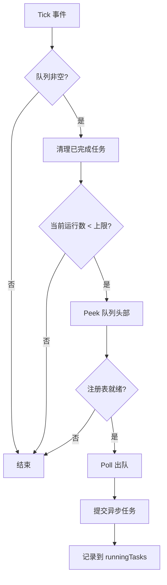
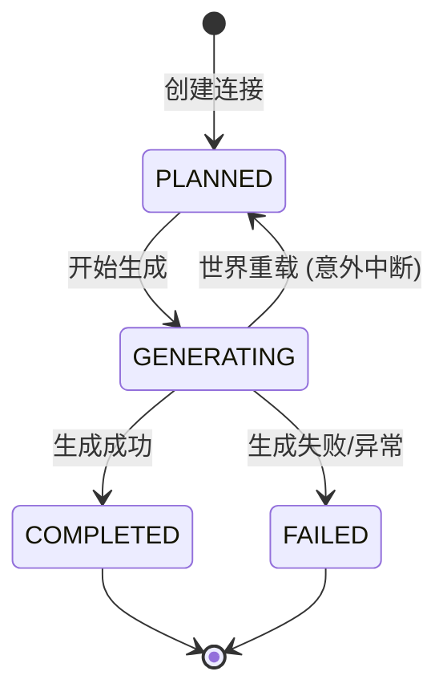
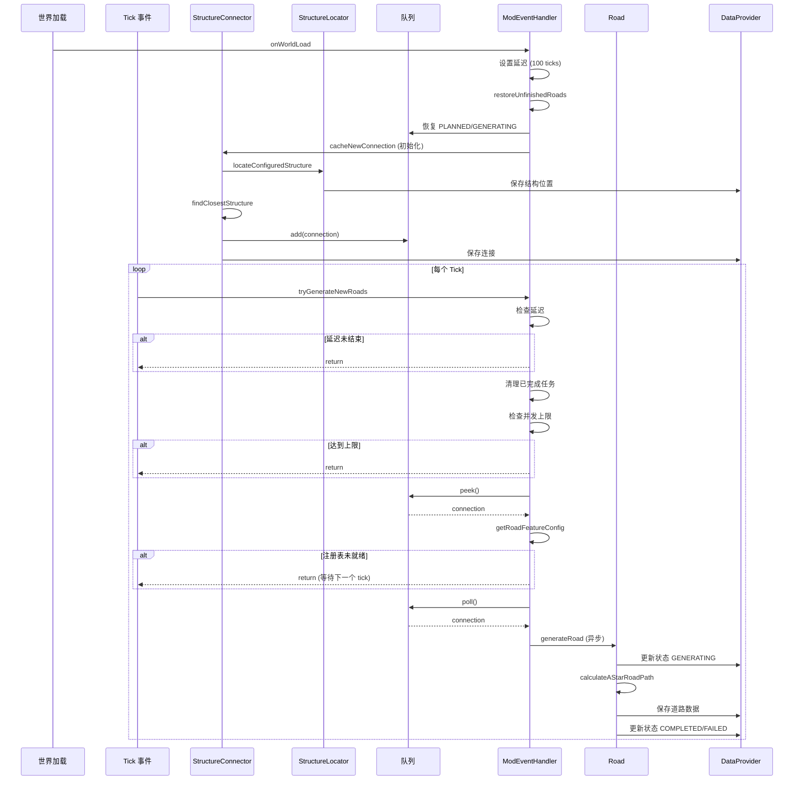

# RoadWeaver 道路搜寻与队列逻辑详细分析

## 📋 目录
1. [系统架构概览](#系统架构概览)
2. [核心数据结构](#核心数据结构)
3. [结构搜寻流程](#结构搜寻流程)
4. [队列管理机制](#队列管理机制)
5. [道路生成流程](#道路生成流程)
6. [并发控制](#并发控制)
7. [状态管理](#状态管理)
8. [关键时序图](#关键时序图)

---

## 系统架构概览

### 核心组件关系
```
ModEventHandler (事件驱动)
    ↓
StructureConnector (连接管理)
    ↓
StructureLocator → StructureLocatorImpl (结构搜寻)
    ↓
WorldDataProvider (数据持久化)
    ↓
Road → RoadPathCalculator (道路生成)
```

---

## 核心数据结构

### 1. **StructureConnection** (结构连接)
```java
public record StructureConnection(
    BlockPos from,              // 起点
    BlockPos to,                // 终点
    ConnectionStatus status,    // 状态
    boolean manual              // 是否手动创建
)
```

**状态枚举 (ConnectionStatus):**
- `PLANNED` - 已规划，等待生成
- `GENERATING` - 生成中
- `COMPLETED` - 已完成
- `FAILED` - 生成失败

### 2. **全局队列**
```java
// StructureConnector.java:15
public static Queue<Records.StructureConnection> cachedStructureConnections = new ArrayDeque<>();
```
- **类型**: `ArrayDeque` (双端队列)
- **作用**: 缓存待生成的道路连接
- **线程安全**: ❌ 非线程安全，依赖单线程 tick 访问

### 3. **任务追踪**
```java
// ModEventHandler.java:38
private static final ConcurrentHashMap<String, Future<?>> runningTasks = new ConcurrentHashMap<>();
```
- **键**: `worldKey_timestamp` (世界维度 + 纳秒时间戳)
- **值**: 异步任务的 `Future` 对象

---

## 结构搜寻流程

### 阶段 1: 触发搜寻

#### 1.1 世界加载时初始化
```java
// ModEventHandler.java:82-108
private static void onWorldLoad(ServerLevel level) {
    // 1. 设置初始化延迟 (100 ticks = 5秒)
    worldInitDelay.put(worldKey, INIT_DELAY_TICKS);
    
    // 2. 恢复未完成任务
    restoreUnfinishedRoads(level);
    
    // 3. 初始结构搜寻
    if (structureCount < config.initialLocatingCount()) {
        for (int i = 0; i < config.initialLocatingCount(); i++) {
            StructureConnector.cacheNewConnection(level, false);
        }
    }
}
```

**关键参数:**
- `INIT_DELAY_TICKS = 100` - 延迟 5 秒确保注册表加载完成
- `initialLocatingCount` - 初始搜寻的结构数量 (配置项)

#### 1.2 Tick 事件触发
```java
// ModEventHandler.java:64-70
TickEvent.SERVER_PRE.register(server -> {
    for (ServerLevel level : server.getAllLevels()) {
        if (level.dimension().equals(Level.OVERWORLD)) {
            tryGenerateNewRoads(level, true, 5000);
        }
    }
});
```

### 阶段 2: 执行搜寻

#### 2.1 缓存新连接
```java
// StructureConnector.java:17-41
public static void cacheNewConnection(ServerLevel serverWorld, boolean locateAtPlayer) {
    // 1. 记录当前结构数量
    int beforeCount = dataProvider.getStructureLocations(serverWorld).structureLocations().size();
    
    // 2. 调用平台特定的结构定位
    StructureLocator.locateConfiguredStructure(serverWorld, 1, locateAtPlayer);
    
    // 3. 检查是否找到新结构
    int afterCount = locations.size();
    
    // 4. 至少需要 2 个结构才能创建连接
    if (locations.size() < 2) return;
    
    // 5. 创建新连接
    createNewStructureConnection(serverWorld);
}
```

#### 2.2 结构定位实现
```java
// StructureLocatorImpl.java:37-86
public static void locateConfiguredStructure(ServerLevel level, int locateCount, boolean locateAtPlayer) {
    // 1. 解析目标结构 (支持标签和单个结构)
    Optional<HolderSet<Structure>> targetStructures = resolveStructureTargets(level, config.structuresToLocate());
    
    // 2. 收集搜索中心点
    List<BlockPos> centers = collectSearchCenters(level, locateAtPlayer);
    
    // 3. 遍历中心点搜寻结构
    for (BlockPos center : centers) {
        Pair<BlockPos, Holder<Structure>> result = level.getChunkSource()
            .getGenerator()
            .findNearestMapStructure(level, targetStructures.get(), center, radius, true);
        
        // 4. 去重并添加到已知位置
        if (result != null && !containsBlockPos(knownLocations, structurePos)) {
            knownLocations.add(structurePos);
            newlyFound.add(structurePos);
        }
    }
}
```

**搜索中心点策略:**
```java
// StructureLocatorImpl.java:225-252
private static List<BlockPos> collectSearchCenters(ServerLevel level, boolean locateAtPlayer) {
    if (locateAtPlayer) {
        // 使用所有玩家位置
        for (ServerPlayer player : level.players()) {
            centers.add(player.blockPosition());
        }
    } else {
        // 使用出生点 + 扩展采样点
        BlockPos spawn = level.getSharedSpawnPos();
        centers.add(spawn);
        
        // 在 8 个方向上按半径倍数 (3x, 6x) 采样
        int[] muls = {3, 6};
        for (int m : muls) {
            int d = radius * m;
            // 添加 8 个方向的采样点
            centers.add(spawn.offset(±d, 0, ±d));
        }
    }
}
```

### 阶段 3: 创建连接

#### 3.1 寻找最近结构
```java
// StructureConnector.java:43-71
private static void createNewStructureConnection(ServerLevel serverWorld) {
    // 1. 获取最新添加的结构 (列表末尾)
    BlockPos latestVillagePos = worldStructureLocations.get(worldStructureLocations.size() - 1);
    
    // 2. 寻找最近的其他结构
    BlockPos closestVillage = findClosestStructure(latestVillagePos, worldStructureLocations);
    
    // 3. 检查连接是否已存在 (双向检查)
    if (!connectionExists(connections, latestVillagePos, closestVillage)) {
        // 4. 创建新连接 (默认状态: PLANNED)
        Records.StructureConnection structureConnection = new Records.StructureConnection(latestVillagePos, closestVillage);
        
        // 5. 持久化到数据提供者
        connections.add(structureConnection);
        dataProvider.setStructureConnections(serverWorld, connections);
        
        // 6. 加入队列
        cachedStructureConnections.add(structureConnection);
    }
}
```

#### 3.2 最近结构算法
```java
// StructureConnector.java:83-96
private static BlockPos findClosestStructure(BlockPos currentVillage, List<BlockPos> allVillages) {
    BlockPos closestVillage = null;
    double minDistance = Double.MAX_VALUE;
    
    for (BlockPos village : allVillages) {
        if (!village.equals(currentVillage)) {
            double distance = currentVillage.distSqr(village);  // 平方距离
            if (distance < minDistance) {
                minDistance = distance;
                closestVillage = village;
            }
        }
    }
    return closestVillage;
}
```

---

## 队列管理机制

### 1. 队列操作流程

#### 1.1 入队 (Enqueue)
```java
// StructureConnector.java:61
cachedStructureConnections.add(structureConnection);
```

**入队时机:**
- ✅ 世界加载时恢复 `PLANNED` 和 `GENERATING` 状态的连接
- ✅ 新结构搜寻成功后创建连接
- ✅ `GENERATING` 状态重置为 `PLANNED` 后重新入队

#### 1.2 出队 (Dequeue)
```java
// ModEventHandler.java:150-167
if (!StructureConnector.cachedStructureConnections.isEmpty()) {
    // 1. 先窥视队列头部 (peek)
    Records.StructureConnection structureConnection = StructureConnector.cachedStructureConnections.peek();
    
    // 2. 检查资源是否就绪 (注册表、配置等)
    final RoadFeatureConfig roadConfig = getRoadFeatureConfig(level);
    if (roadConfig == null) {
        return;  // 等待下一个 tick
    }
    
    // 3. 确认资源可用后再真正出队 (poll)
    StructureConnector.cachedStructureConnections.poll();
    
    // 4. 提交生成任务
    submitRoadGenerationTask(structureConnection);
}
```

**关键设计:**
- 🔍 **先 peek 后 poll** - 避免资源未就绪时丢失任务
- ⏳ **延迟出队** - 确保注册表完全加载

### 2. 队列恢复机制

#### 2.1 世界加载时恢复
```java
// ModEventHandler.java:295-339
private static void restoreUnfinishedRoads(ServerLevel level) {
    List<Records.StructureConnection> connections = dataProvider.getStructureConnections(level);
    
    for (int i = 0; i < updatedConnections.size(); i++) {
        Records.StructureConnection connection = updatedConnections.get(i);
        
        // 恢复 PLANNED 和 GENERATING 状态
        if (connection.status() == Records.ConnectionStatus.PLANNED ||
            connection.status() == Records.ConnectionStatus.GENERATING) {
            
            // GENERATING → PLANNED (意外中断的任务)
            if (connection.status() == Records.ConnectionStatus.GENERATING) {
                Records.StructureConnection resetConnection = new Records.StructureConnection(
                    connection.from(), connection.to(), Records.ConnectionStatus.PLANNED, connection.manual()
                );
                updatedConnections.set(i, resetConnection);
                StructureConnector.cachedStructureConnections.add(resetConnection);
            } else {
                // PLANNED 直接加入队列
                StructureConnector.cachedStructureConnections.add(connection);
            }
        }
        // COMPLETED 和 FAILED 不处理
    }
}
```

**恢复策略:**
| 原状态 | 操作 | 新状态 |
|--------|------|--------|
| `PLANNED` | 直接入队 | `PLANNED` |
| `GENERATING` | 重置后入队 | `PLANNED` |
| `COMPLETED` | 忽略 | `COMPLETED` |
| `FAILED` | 忽略 | `FAILED` |

---

## 道路生成流程

### 阶段 1: 任务调度

#### 1.1 并发检查
```java
// ModEventHandler.java:111-148
private static void tryGenerateNewRoads(ServerLevel level, Boolean async, int steps) {
    // 1. 检查初始化延迟
    Integer delayTicks = worldInitDelay.get(worldKey);
    if (delayTicks != null && delayTicks > 0) {
        worldInitDelay.put(worldKey, delayTicks - 1);
        return;  // 还在延迟期内
    }
    
    // 2. 清理已完成的任务
    runningTasks.entrySet().removeIf(entry -> entry.getValue().isDone());
    
    // 3. 并发上限检查
    int currentRunning = runningTasks.size();
    if (currentRunning >= config.maxConcurrentRoadGeneration()) {
        return;  // 达到并发上限
    }
    
    // 4. 从队列取出任务
    // ... (见队列管理部分)
}
```

**并发控制参数:**
- `maxConcurrentRoadGeneration` - 最大并发道路生成数 (配置项)
- `THREAD_COUNT = 7` - 线程池大小

#### 1.2 异步任务提交
```java
// ModEventHandler.java:172-196
if (async) {
    String taskId = level.dimension().location().toString() + "_" + System.nanoTime();
    Future<?> future = executor.submit(() -> {
        try {
            new Road(level, structureConnection, roadConfig).generateRoad(steps);
            LOGGER.info("✅ Road generation completed");
        } catch (Exception e) {
            LOGGER.error("❌ Error generating road", e);
            markConnectionAsFailed(level, structureConnection);
        } finally {
            runningTasks.remove(taskId);
        }
    });
    runningTasks.put(taskId, future);
}
```

### 阶段 2: 道路生成

#### 2.1 生成主流程
```java
// Road.java:30-70
public void generateRoad(int maxSteps) {
    // 1. 更新状态为 GENERATING
    updateConnectionStatus(Records.ConnectionStatus.GENERATING);
    
    // 2. 随机选择道路参数
    int width = getRandomWidth(random, context.getWidths());
    int type = allowedRoadTypes(random, cfg);  // 0=人工, 1=自然
    List<BlockState> material = getRandomMaterials(random, materialsList);
    
    // 3. 获取阈值参数
    int maxHeightDiff = structureConnection.manual() 
        ? cfg.manualMaxHeightDifference() 
        : cfg.maxHeightDifference();
    int maxStability = structureConnection.manual() 
        ? cfg.manualMaxTerrainStability() 
        : cfg.maxTerrainStability();
    
    // 4. 计算 A* 路径
    List<Records.RoadSegmentPlacement> roadSegmentPlacementList = 
        RoadPathCalculator.calculateAStarRoadPath(
            start, end, width, serverWorld, maxSteps, maxHeightDiff, maxStability
        );
    
    // 5. 保存道路数据
    if (!roadSegmentPlacementList.isEmpty()) {
        mutableList.add(new Records.RoadData(width, type, material, roadSegmentPlacementList));
        dataProvider.setRoadDataList(serverWorld, mutableList);
        updateConnectionStatus(Records.ConnectionStatus.COMPLETED);
    } else {
        updateConnectionStatus(Records.ConnectionStatus.FAILED);
    }
}
```

#### 2.2 手动 vs 自动连接
| 参数 | 自动连接 | 手动连接 |
|------|----------|----------|
| 最大高度差 | `maxHeightDifference` | `manualMaxHeightDifference` |
| 地形稳定性 | `maxTerrainStability` | `manualMaxTerrainStability` |
| 特点 | 保守策略 | 激进策略 (更宽容) |

---

## 并发控制

### 1. 线程池配置
```java
// ModEventHandler.java:35-37
private static final int THREAD_COUNT = 7;
private static ExecutorService executor = Executors.newFixedThreadPool(THREAD_COUNT);
```

### 2. 任务追踪
```java
// ModEventHandler.java:38
private static final ConcurrentHashMap<String, Future<?>> runningTasks = new ConcurrentHashMap<>();
```

**任务 ID 格式:**
```
minecraft:overworld_1234567890123456789
└─────┬─────┘ └──────────┬──────────┘
   世界维度        纳秒时间戳
```

### 3. 并发限制流程


### 4. 生命周期管理
```java
// ModEventHandler.java:73-79
LifecycleEvent.SERVER_STOPPING.register(server -> {
    RoadPathCalculator.heightCache.clear();
    runningTasks.values().forEach(future -> future.cancel(true));
    runningTasks.clear();
    executor.shutdownNow();
});
```

---

## 状态管理

### 1. 状态转换图


### 2. 状态更新实现
```java
// Road.java:72-87
private void updateConnectionStatus(Records.ConnectionStatus newStatus) {
    List<Records.StructureConnection> connections = dataProvider.getStructureConnections(serverWorld);
    List<Records.StructureConnection> mutableConnections = new ArrayList<>(connections);
    
    for (int i = 0; i < mutableConnections.size(); i++) {
        Records.StructureConnection conn = mutableConnections.get(i);
        // 双向匹配 (from->to 或 to->from)
        if ((conn.from().equals(structureConnection.from()) && conn.to().equals(structureConnection.to())) ||
            (conn.from().equals(structureConnection.to()) && conn.to().equals(structureConnection.from()))) {
            mutableConnections.set(i, new Records.StructureConnection(
                conn.from(), conn.to(), newStatus, conn.manual()
            ));
            dataProvider.setStructureConnections(serverWorld, mutableConnections);
            break;
        }
    }
}
```

### 3. 失败处理
```java
// ModEventHandler.java:265-281
private static void markConnectionAsFailed(ServerLevel level, Records.StructureConnection structureConnection) {
    // 1. 获取所有连接
    List<Records.StructureConnection> connections = dataProvider.getStructureConnections(level);
    List<Records.StructureConnection> mutableConnections = new ArrayList<>(connections);
    
    // 2. 查找并更新状态
    for (int i = 0; i < mutableConnections.size(); i++) {
        Records.StructureConnection conn = mutableConnections.get(i);
        if (matchesConnection(conn, structureConnection)) {
            mutableConnections.set(i, new Records.StructureConnection(
                conn.from(), conn.to(), Records.ConnectionStatus.FAILED, conn.manual()
            ));
            dataProvider.setStructureConnections(level, mutableConnections);
            break;
        }
    }
}
```

---

## 关键时序图

### 完整流程时序


---

## 配置参数汇总

### 结构搜寻相关
| 参数 | 类型 | 说明 |
|------|------|------|
| `structuresToLocate` | `List<String>` | 目标结构列表 (支持标签 `#` 和单个结构) |
| `structureSearchRadius` | `int` | 搜索半径 (区块) |
| `initialLocatingCount` | `int` | 世界加载时初始搜寻数量 |

### 道路生成相关
| 参数 | 类型 | 说明 |
|------|------|------|
| `maxConcurrentRoadGeneration` | `int` | 最大并发生成数 |
| `maxHeightDifference` | `int` | 自动连接最大高度差 |
| `maxTerrainStability` | `int` | 自动连接地形稳定性阈值 |
| `manualMaxHeightDifference` | `int` | 手动连接最大高度差 (更宽容) |
| `manualMaxTerrainStability` | `int` | 手动连接地形稳定性阈值 (更宽容) |

### 道路外观相关
| 参数 | 类型 | 说明 |
|------|------|------|
| `allowArtificial` | `boolean` | 允许人工道路材质 |
| `allowNatural` | `boolean` | 允许自然道路材质 |
| `averagingRadius` | `int` | 高度平均化半径 |

---

## 潜在问题与优化建议

### 1. 线程安全问题
**问题:** `cachedStructureConnections` 使用非线程安全的 `ArrayDeque`

**风险:**
- 虽然当前设计依赖单线程 tick 访问，但多线程任务完成回调可能导致竞态条件

**建议:**
```java
// 替换为线程安全队列
public static Queue<Records.StructureConnection> cachedStructureConnections = 
    new ConcurrentLinkedQueue<>();
```

### 2. 队列持久化缺失
**问题:** 队列仅在内存中，服务器崩溃会丢失队列内容

**建议:**
- 依赖 `restoreUnfinishedRoads` 从持久化数据恢复
- 当前设计已通过状态恢复机制缓解此问题

### 3. 搜索中心点策略
**优点:**
- 多方向采样提高覆盖率
- 玩家位置优先确保相关性

**可优化:**
- 添加已搜索区域记录，避免重复搜索
- 动态调整采样半径倍数

### 4. 并发控制
**优点:**
- 线程池复用减少开销
- 任务追踪支持清理和取消

**可优化:**
- 根据服务器性能动态调整线程池大小
- 添加任务优先级队列 (手动连接优先)

---

## 总结

### 核心设计亮点
1. ✅ **Peek-Poll 模式** - 确保资源就绪后再出队
2. ✅ **状态恢复机制** - 世界重载后自动恢复未完成任务
3. ✅ **初始化延迟** - 避免注册表未就绪导致的错误
4. ✅ **双向连接检查** - 防止重复创建相同连接
5. ✅ **手动/自动阈值分离** - 灵活的生成策略

### 数据流向
```
结构搜寻 → 连接创建 → 队列缓存 → 任务调度 → 道路生成 → 状态更新 → 数据持久化
    ↑                                                              ↓
    └──────────────────────── 世界重载恢复 ←─────────────────────┘
```

### 关键指标
- **队列类型**: `ArrayDeque` (FIFO)
- **并发模型**: 固定线程池 (7 线程)
- **状态数**: 4 种 (PLANNED, GENERATING, COMPLETED, FAILED)
- **初始化延迟**: 100 ticks (5 秒)
- **搜索采样**: 1 + 16 个中心点 (出生点 + 8方向 × 2倍数)
